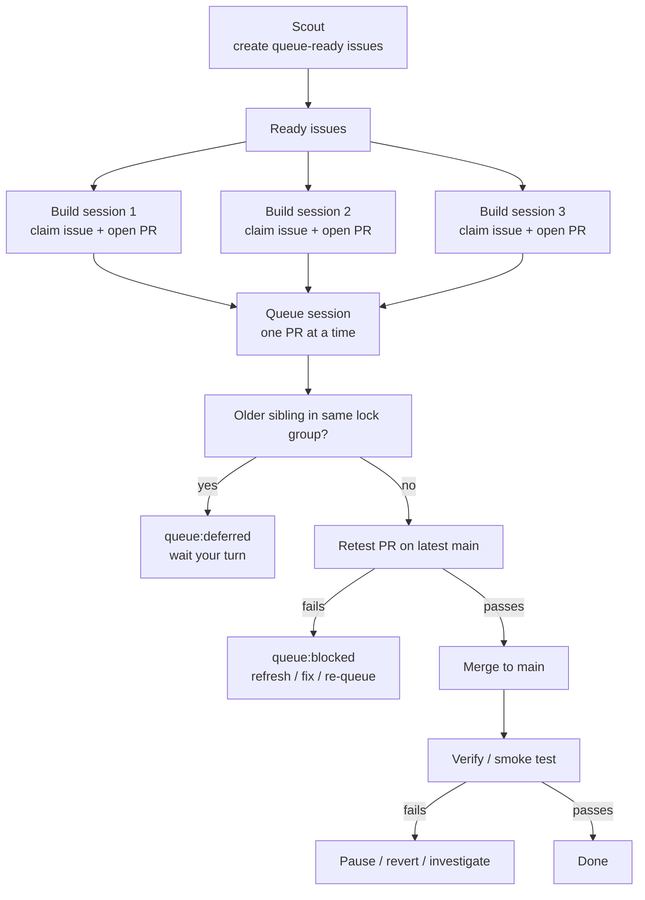

# Clankerism

Clankerism is the work-queue model that replaced the old single-agent `/evolve`
loop. Work lives in **GitHub Issues** and **GitHub PRs**, not in local queue
files. This directory holds the small amount of durable state and policy that
the queue needs.

## Directory layout

```text
.clankerism/
  README.md         # this file
  labels.json       # issue taxonomy + optional operational labels
  lessons.md        # durable lessons; not a changelog
  scout-state.md    # /scout's memory: last sweep cursor, open findings
  PAUSED            # touch this file to halt build/queue runners gracefully
  archive/          # legacy state files kept only for history
```

For unattended runs, the remote repo variable `CLANKERISM_PAUSED` is also an
authoritative brake.

## The 5 roles

| Role     | Purpose | Analogy |
|----------|---------|---------|
| `/scout` | Finds work and files issues | Restaurant inspector |
| `/build` | Claims one issue or repairs one blocked PR, then hands it to the queue | Line cook |
| `/queue` | Re-tests PRs on latest `main` and merges one at a time | Expeditor |
| `/verify` | Runs smoke/regression checks after merge | Food taster |
| `/fix` | Handles fires and blocked work on demand | Handyman |

The key v2 rule is simple: **many builders can cook, but only the queue can
publish to `main`.**

## Canonical flow



In plain English:

1. `scout` creates small issues with clear scope.
2. `build` claims one issue or resumes one blocked PR, implements the fix,
   validates it, and hands it to the queue.
3. The builder marks the PR `queue:ready` and stops. Builders do **not** merge.
4. `queue` waits for the normal GitHub `CI / build-and-test` check, then tests
   the GitHub merge ref against the newest `main`, and merges the PR if safe.
5. `verify` does smoke/regression checks after merge.

## Issue and PR metadata

### Issue taxonomy

Every issue still carries exactly one label from each axis:

- `state`: `state:ready` | `state:in-progress` | `state:blocked` | `state:stale`
- `priority`: `p0` | `p1` | `p2` | `p3`
- `type`: `type:bug` | `type:refactor` | `type:feature`
- `source`: `source:scout` | `source:manual` | `source:migration`

### Operational labels

PRs may additionally carry queue-only operational labels:

- `queue:ready`: ready for serialized queue validation on latest `main`
- `queue:active`: currently being validated by the queue runner
- `queue:deferred`: ready, but waiting behind an older open PR in the same lock group
- `queue:blocked`: queue rejected this PR; refresh or fix before re-queueing

### Required issue / PR fields

Every non-trivial issue and PR should declare:

- `Lock group`: one shared area like `server-core`, `db-schema`,
  `dashboard-feed`, or `auth`
- `Write set`: the files, folders, or modules expected to change

These fields are intentionally simple. They are the guardrail that tells us
when parallel builders can proceed safely and when they should take turns.

Rule of thumb:

- Different lock groups and different write sets: safe to build in parallel
- Same lock group: one merge lane, ordered by oldest open PR first
- Same hot file or same shared area: serialize it

## Builder flow

When a builder runs, it may consume either a ready issue or a blocked PR:

1. Check the soft brake. If `.clankerism/PAUSED` exists, exit immediately.
2. Prefer blocked repairs before fresh work within the same priority lane.
3. Claim the work atomically:

   Fresh issue: the push of `build/issue-<N>` is the lock:

   ```bash
   git checkout -b build/issue-<N>
   git push -u origin build/issue-<N>
   gh issue edit <N> --remove-label state:ready --add-label state:in-progress
   ```

   Blocked PR: the push of `repair/pr-<PR>` is the repair lock, while the real
   code changes still go onto the existing `build/issue-<N>` branch:

   ```bash
   git fetch origin build/issue-<N>
   git checkout -b repair/pr-<PR> origin/build/issue-<N>
   git push -u origin repair/pr-<PR>
   git checkout -B build/issue-<N> origin/build/issue-<N>
   gh issue edit <N> --remove-label state:blocked --add-label state:in-progress
   ```

4. Implement the smallest diff that fully solves the issue.
5. Run local validation:

   ```bash
   pnpm run build
   pnpm run lint
   pnpm run format:check
   # plus the narrowest relevant tests
   ```

6. If this is fresh work, open a PR with:
   - `Fixes #<N>`
   - lock group
   - write set
7. When the PR is genuinely ready for serialized merge, add `queue:ready`.
   For blocked repairs, reuse the existing PR instead of opening a replacement.
8. If an older open PR already occupies the same lock group, the queue will add
   `queue:deferred` automatically and wait.
9. Release any `repair/pr-<PR>` lock branch you claimed.
10. Stop there. The builder does **not** merge the PR.
11. If the queue marks the PR `queue:blocked`, the linked issue flips to
    `state:blocked`. A future `/build` run may repair it and re-add
    `queue:ready`.

## Queue flow

Run exactly one queue session at a time on a trusted machine or runner:

```bash
pnpm run clanker:queue:loop
```

The queue runner:

1. Checks `.clankerism/PAUSED` before each cycle.
2. Scans open PRs, derives their lock groups, and adds or removes
   `queue:deferred` on younger `queue:ready` PRs that are waiting behind an
   older open PR in the same lock group.
3. Picks the oldest eligible `queue:ready` PR whose lock group is not already
   occupied by an older open PR.
4. Waits for the required GitHub PR check `CI / build-and-test` to finish.
   Pending checks leave the PR in `queue:ready`; failed checks flip it to
   `queue:blocked`.
5. Moves the PR to `queue:active` so other queue runners do not touch it.
6. Materializes GitHub's synthetic merge ref `pull/<N>/merge` in a temporary
   worktree.
7. Re-runs the merge gate on that merged tree:

   ```bash
   corepack pnpm install --frozen-lockfile
   corepack pnpm run build
   corepack pnpm run lint
   corepack pnpm run format:check
   corepack pnpm test
   corepack pnpm run test:dashboard
   ```

8. If validation passes, merges the PR with squash + branch delete and clears
   the linked issue's `state:in-progress` label when the branch name matches
   `build/issue-<N>`.
9. If validation fails, removes `queue:active`, adds `queue:blocked`, flips the
   linked issue back to `state:blocked`, and posts a comment with the failing
   step.

Useful commands:

```bash
pnpm run clanker:labels       # sync labels from .clankerism/labels.json
pnpm run clanker:queue        # run one queue cycle
pnpm run clanker:queue:loop   # keep checking for ready PRs
pnpm run clanker:verify       # run the lightweight HTTP smoke verifier
```

## Autonomous mode

Clankerism now automates the boring publisher/watchdog stages inside GitHub:

- `.github/workflows/clanker-queue.yml` runs the serialized queue on PR
  activity, on `CI` completion, and on a 10-minute schedule
- `.github/workflows/clanker-verify.yml` runs a lightweight smoke verifier on
  successful `main` CI completions and on an hourly canary schedule

That means merge + smoke verify can happen without a human in the loop. The
creative stages still stay agent-driven:

- `/scout` produces issues
- `/build` consumes one ready issue or one blocked PR and stops at `queue:ready`
- `/queue` may mark a PR `queue:deferred` until its lock-group lane is clear

## Verify flow

`verify` is intentionally lightweight:

- rely on the existing deploy health check for `main`
- use `/verify` or browser smoke tests for risky dashboard or end-to-end changes
- if a merge regresses production, pause the queue, investigate, and revert if
  needed

The queue should stay dumb and predictable. It answers only one question:
**"did GitHub CI pass, and is this PR still safe on top of the newest `main`?"**

## Soft brake

```bash
touch .clankerism/PAUSED
```

Every local clanker runner checks for this file before taking destructive
action. Remove the file to resume.

For a remote/global brake that GitHub Actions also respects:

```bash
pnpm run clanker:pause -- --reason "why we stopped"
pnpm run clanker:status
pnpm run clanker:resume
```

## Safety model

This repo is private on the free GitHub plan, so we cannot rely on GitHub's
native merge queue or branch rulesets. Clankerism v2 uses five practical layers:

1. **Pre-push hook** (`scripts/hooks/pre-push`), auto-installed by `pnpm install`
   via `postinstall`, rejects:
   - direct pushes to `main` unless `CLANKERISM_ALLOW_MAIN=1`
   - non-fast-forward pushes unless `CLANKERISM_ALLOW_FORCE=1` and the branch is
     not `main`
2. **Issue-branch lock**. `build/issue-<N>` is the single-writer lock for one
   issue.
3. **Repair lock**. `repair/pr-<N>` prevents parallel builders from dogpiling
   the same blocked PR.
4. **Serialized queue**. Only the queue runner merges; builders stop at `queue:ready`.
5. **Synthetic merge validation**. The queue tests `pull/<N>/merge`, not the
   stale branch tip.
6. **Deploy + autonomous verify**. `main` still has to survive deploy and the
   scheduled smoke verifier.
7. **Remote brake**. Autonomous queue + verify runs stop when the
   `CLANKERISM_PAUSED` repo variable is set.

## Known uncovered risks

- A human can still merge a PR outside the queue. Clankerism depends on social
  discipline until the repo moves to stronger server-side enforcement.
- `queue:active` is still a label-based claim, not a transactional server-side
  lock. It is much better than manual merging, but GitHub Pro branch rules would
  still be stronger.
- The local `.clankerism/PAUSED` file and the remote `CLANKERISM_PAUSED`
  variable can drift if someone uses only one of them. The remote brake is now
  the one that matters for GitHub Actions.
- Lock groups are still declared by humans/agents. The queue now enforces lane
  ordering once PRs exist, but issue scoping and builder behavior still depend
  on correct metadata and judgment.
- A stale `repair/pr-<N>` branch can strand a blocked PR until someone deletes
  the stale repair lock. `/build` is expected to release it on exit, but a hard
  crash can still leak one.

## Attempt memory (`.clankerism/attempts/issue-<N>.ndjson`)

`/build` and `/build-codex` write an NDJSON audit trail per issue so retries
learn from prior failures. The file lives in the **main checkout** (not the
worktree) so it survives `node scripts/worktree.mjs release`.

Location: `.clankerism/attempts/issue-<N>.ndjson` (gitignored).

One record per attempt, appended atomically by Claude. Schema:

```json
{
  "ts": "2026-04-11T17:42:13Z",
  "tick_id": "1744396933000",
  "attempt": 2,
  "run": "build-codex",
  "outcome": "gate_failed",
  "gate_step": "test",
  "output_excerpt": "FAIL src/normalize/spam.test.ts ...",
  "diff_summary": {
    "files_changed": 3,
    "lines_added": 47,
    "lines_removed": 12,
    "files": ["src/normalize/spam.ts", "src/normalize/spam.test.ts"]
  },
  "terminal": false
}
```

- `outcome` ∈ `pass | gate_failed | hard_error`
- `gate_step` ∈ `build | lint | format:check | test | test:dashboard | remote-ci | adversarial-review | none`
- `output_excerpt` — first 40 lines of failure output, ANSI-stripped
- `terminal: true` — marker on the final record when the issue is flipped to
  `state:blocked` for good

Budget math: **3 local attempts per run, 5 total failed attempts per issue
across all runs.** "Failed" means `outcome != "pass"`. A `pass` record does
not burn budget; a local-pass-then-remote-red still burns the remote-ci
record. When the sixth failed attempt would be about to write, the run
comments on the issue, writes a `terminal: true` marker, and flips to
`state:blocked`.

Lifecycle:

- **Create**: on the first attempt for an issue. `mkdir -p .clankerism/attempts` first.
- **Append**: every attempt, from main-checkout cwd.
- **Delete**: on `clean_win` (PR merged), right before worktree release.
- **Preserve**: on `state:blocked`, keep the file for human/repair inspection.
- **GC**: `node scripts/worktree.mjs gc` removes NDJSON files for closed+merged issues.

Parsing contract: any line that doesn't start with `{` is ignored (tolerates
partial-write corruption). Any parseable line whose `outcome` is not
literally `"pass"` counts against the 5-attempt ceiling.
